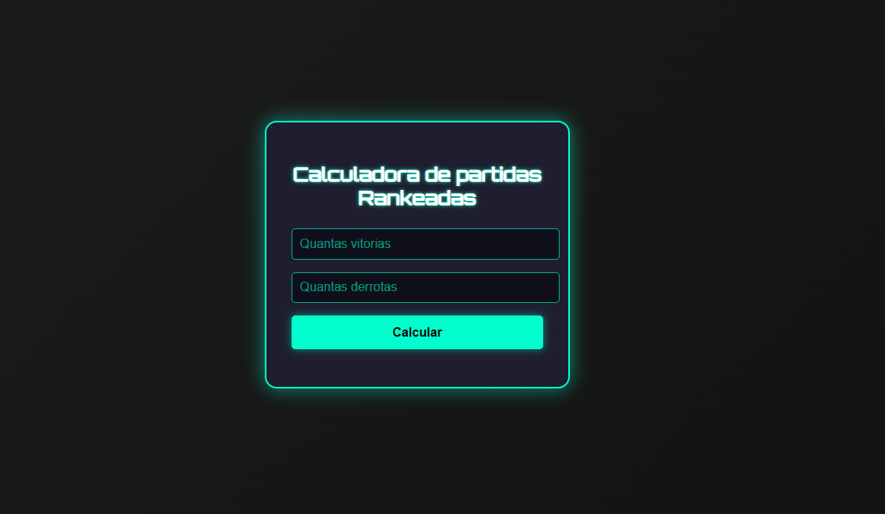

# 🧮 Calculadora de Partidas Rankeadas (CURSO GFT na plataforma DIO) 🎮

Este é um pequeno projeto de desafio de código feito com HTML, CSS e JavaScript que calcula o saldo de vitórias e derrotas de um jogador e exibe seu nível em uma hierarquia de ranques, com um visual inspirado no universo gamer.

## 🚀 Funcionalidades

- Entrada de número de vitórias e derrotas
- Cálculo automático do saldo
- Exibição do nível do herói com base no saldo
- Interface estilizada com tema de jogo (modo neon/dark)

## 📊 Regras de Ranqueamento

| Saldo de Vitórias | Nível         |
|-------------------|---------------|
| 0 - 10            | FERRO         |
| 11 - 20           | BRONZE        |
| 21 - 50           | PRATA         |
| 51 - 80           | OURO          |
| 81 - 90           | DIAMANTE      |
| 91 - 100          | LENDÁRIO      |
| 101+              | IMORTAL       |

## 🛠️ Tecnologias Utilizadas

- **HTML5**
- **CSS3** (com tema visual gamer)
- **JavaScript Vanilla**

## 🎨 Estilo Gamer

- Fundo escuro com neon verde e ciano
- Fonte `Orbitron` do Google Fonts (estilo futurista)
- Efeitos de sombra e brilho para reforçar o tema de jogo

## 📷 Preview

## 📁 Como Usar

1. Clone ou baixe este repositório
2. Abra o arquivo `index.html` no navegador
3. Insira o número de vitórias e derrotas
4. Clique em **Calcular** e veja o nível do herói!

## 💡 Melhorias Futuras

- Adicionar animações com CSS ou JS
- Efeitos sonoros ao clicar
- Adicionar modo escuro/claro
- Transformar em app mobile

---

Feito com 💚 por [fabio-italo]
